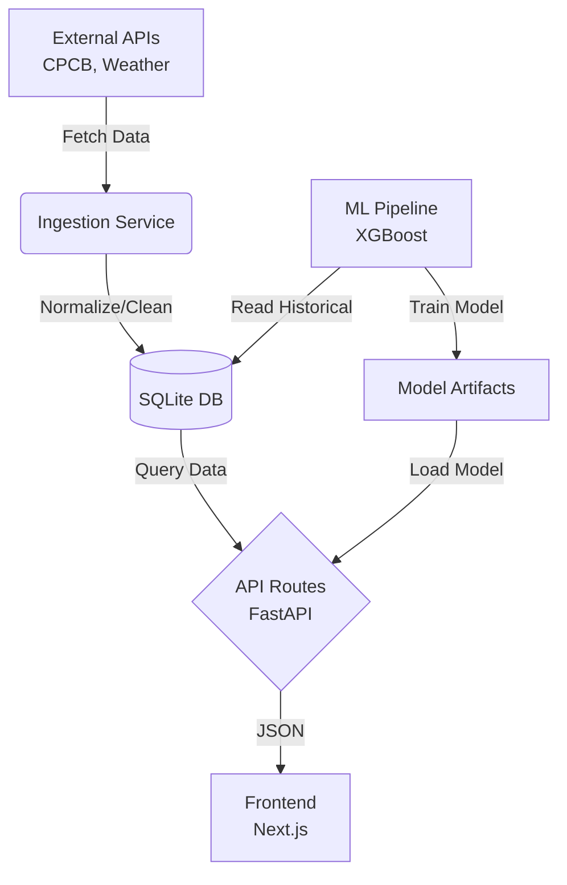

# AeroSense Architecture

## Data Flow Diagram

## Components

1. **Backend (FastAPI)**: Serves the REST API. Handles routing, schema validation (Pydantic), and database interactions (SQLAlchemy). Contains business logic for calculating AQI.
2. **Frontend (Next.js)**: Provides an interactive UI. Uses React Query for data fetching and caching. Components like Map and Charts visualize air quality data.
3. **ML Pipeline**: A module for data preprocessing, feature engineering (temporal, lag, rolling), and training an XGBoost regressor to predict PM2.5 levels.
4. **Data Layer**: An SQLite database for structured storage of station metadata and historical observations.

## Technology Choices

- **FastAPI**: High performance, easy to use, automatic Swagger documentation.
- **SQLite**: Simple setup, zero configuration, perfectly adequate for a local development or small-scale application like this demo.
- **Next.js & React**: Modern frontend development, rich ecosystem, component-based architecture.
- **XGBoost**: Robust, state-of-the-art tree-based algorithm, highly effective for tabular time-series data.
